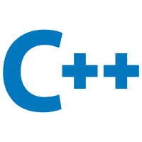

### Hi there, I'm JasonZYT:wave:

🌱 I'm a middle school student  
⚡ I'm also a developer of Minecraft BDS  
💬 You can contact me by Email/Twitter/QQ   
:earth_asia: I come from Wuhan,Hubei Province,PRC(`🕗 GMT/UTC+8`)  

#### :computer:LANGUAGES

<!-- languages:start -->
<!-- prettier-ignore-start -->
<!-- markdownlint-disable -->
<code></code>
<code></code>
<code></code>
<code></code>
<code></code>
<code></code>
<code></code>
<code></code>
<!-- markdownlint-restore -->
<!-- prettier-ignore-end -->
<!-- languages:end -->

#### :video_game:GAMES

<!-- interested:start -->
<!-- prettier-ignore-start -->
<!-- markdownlint-disable -->
<code></code>
<code>&nbsp;TECH OTAKUS SAVE THE WORLD!!!</code>
<!-- markdownlint-restore -->
<!-- prettier-ignore-end -->
<!-- interested:end -->
  
#### :memo:ORGANIZATIONS
  
<!-- organization:start -->
<!-- prettier-ignore-start -->
<!-- markdownlint-disable -->
<code>&nbsp;<a href="https://github.com/LiteLDev">@LiteLDev</a></code>
<!-- markdownlint-restore -->
<!-- prettier-ignore-end -->
<!-- orgainization:end -->

#### :open_file_folder:REPOSITORIES

<!-- repos:start -->
<!-- prettier-ignore-start -->
<!-- markdownlint-disable -->
<!-- Key: 31, Value: 59 -->
<!-- This is a fake console XD -->
<pre>
root@jasonzyt:~$ github repo list
 GitHub Repositories Tool | Author: Jasonzyt
 |============= KEY =============|========================== VALUE ==========================|
 | <a href="https://github.com/Jasonzyt/FakePlayerHelper"   >Jasonzyt/FakePlayerHelper</a>     | A simple FakePlayer manager plugin                    C++ |
 | <a href="https://github.com/Jasonzyt/BDSWebSocket"       >Jasonzyt/BDSWebSocket(WIP)</a>    | An open-source WebSocket(Server) API plugin for BDS   C++ |
 | <a href="https://github.com/Jasonzyt/QuickBackupX"       >Jasonzyt/QuickBackupX</a>         | A backup plugin for BDS                               C++ |
 | <a href="https://github.com/Jasonzyt/File-Web-Repository">Jasonzyt/File-Web-Repository</a>  | A personal file repository website                    PHP |
 | <a href="https://github.com/Jasonzyt/PHPBackupAPI"       >Jasonzyt/PHPBackupAPI</a>         | Backup APIs based on PHP&HTTP                         PHP |
 | <a href="https://github.com/LiteLDev/LiteLoaderBDS"      >LiteLDev/LiteLoaderBDS</a>        | A lightweight plugin loader for BDS                   C++ |
 | <a href="https://github.com/LiteLDev/LiteXLoader"        >LiteLDev/LiteXLoader</a>          | A cross-language script plugin loader for BDS         C++ |
 | <a href="https://github.com/ddf8196/FakePlayer"          >ddf8196/FakePlayer</a>            | A fake player client for Minecraft: Bedrock Edition  Java |
 |===============================|===========================================================|
root@jasonzyt:~$ rm -rf /*▍
</pre>
<!-- markdownlint-restore -->
<!-- prettier-ignore-end -->
<!-- repos:end -->

> `0 Error(s), 0 Warning(s)`
